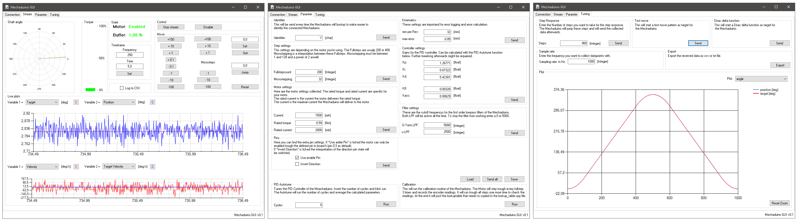

Derivation of the original Mechaduino code from jcchurch13.

# Firmware
### Changes:

- added an enable pin (pin 2, only 3.3 V compatible)
- Menu entry for generating a step response
- Menu entry for generating a dirac delta function
- deleted all modes other than position 
- changed all float to integer operations
- added some filtering to the effort and D-Term
- Changed the frequency of the PID loop to 5 kHz
- Encoder readings are placed in its own ISR that runs with 10 kHz (oversampling)
- maximal step frequency = 40 kHz
- changed the PWM resolution from 8 bit to 9 bit
- PID auto tuning
- The lookup table is now in its own file (lookup_table.cpp)
- The Parameters are now in Configuration.cpp
- Added Language file for easy translation
- added an invert direction setting
- simple error register to save if an error occurred
- LED shows errors by different blinking patterns
- downhill simplex algorithm to fine tune the pid settings

### LED blink pattern:
If an error occures the led will switch from constant on to different patterns. These patterns are separated from each other by a longer pause. After this pause one pattern will be shown and then after the pause the next pattern will be shown.

|Pattern| Error|
|-------|------|
|Fast blinking | Timing error. This can occur if the mechaduino receives too much steps. Consider lowering your microsteps or limit the maximal speed|
|Long on | maximal error was reached|
|Long on, one flash | the maximal current was reached|
|Long on, two flashs | the lookup table shows some errors|

### List of commands
To get an list of the possible commands send help over the serial monitor

|Command|Description|
|-------|-----------|
|help | prints this menu|
|error | outputs the mechaduino error register|
|reset_error | resets the mechaduino error register|
|diagnose | read Encoder Diagnostics|
|check | check the lookup table|
|enable | enables the motor|
|disable | disables the motor|
|param | print the current PID parameter|
|editparam | submenu to edit the parameter|
|read | reads the current angle|
|set | enter new set point|
|state | shows the current motor state|
|calibrate | starts the calibration routine|
|autotune | PID auto tune|
|response | generates a step response|
|noise | measures the noise of the encoder|
|reset | resets the board|
|test | starts a test move|
|downhill | starts the downhill simplex algorithm|

# Windows GUI

- Live view/stream motor parameter (angle, error, effort, ...)
- generate and analyze different test moves with different sampling rates (step response, dirac delta function, ...)
- change parameters without the need of serial commands
- generate a configuration file 
- Log streamed motor parameter as txt or csv file

# License
All Mechaduino related materials are released under the Creative Commons Attribution Share-Alike 4.0 License
https://creativecommons.org/licenses/by-sa/4.0/

Much of the work is based on Mechaduino project:
https://github.com/jcchurch13/Mechaduino-Firmware

# Support
If you want to support me for further improvements and things like that, you can send me a small kickback with PayPal

