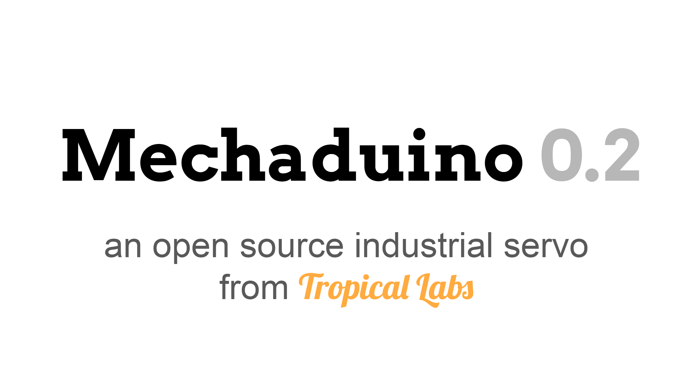

Derivation of the original Mechaduino code from jcchurch13.

Original code can be found under: https://github.com/jcchurch13/Mechaduino-Firmware/tree/multi-file/Mechaduino_01/Mechaduino_01

### Changes:

- added an enable pin (pin 2, only 3.3 V compatible)
- Some other changes 
- Menu entry for generating a step response
- Menu entry for generating a dirac delta function
- deleted all modes other than position 
- changed all float to integer operations
- added some filtering to the effort and D-Term
- Changed the frequency of the PID loop to 5 kHz
- Encoder readings are placed in its own ISR that runs with 10 kHz (oversampling)
- changed the PWM resolution from 8 bit to 9 bit
- PID auto tuning
- LED shows errors by different blinking patterns
- The lookup table is now in its own file (lookup_table.cpp)
- The Parameters are now in Configuration.cpp
- Added Language file for easy translation
- added an invert direction setting

### LED blink pattern:
- Fast blinking: Timing error. This can occur if the mechaduino receives too much steps. Consider lowering your microsteps or limit the maximal speed
- Slow blinking: maximal error was reached
- Long on, short off: the maximal current was reached 
- Long on, short off, short on, short off: the lookup table shows some errors

# Windows GUI

- Live view/stream motor parameter (angle, error, effort, ...)
- generate and analyze a step response with different sampling rates
- change parameters without the need of serial commands
- generate a configuration file 
- Log motor parameter as txt or csv file

# License

All Mechaduino related materials are released under the Creative Commons Attribution Share-Alike 4.0 License
Much of the work is based on Mechaduino project:
https://github.com/jcchurch13/Mechaduino-Firmware

If you want to support me for further improvements and things like that, you can send me a small kickback with PayPal

